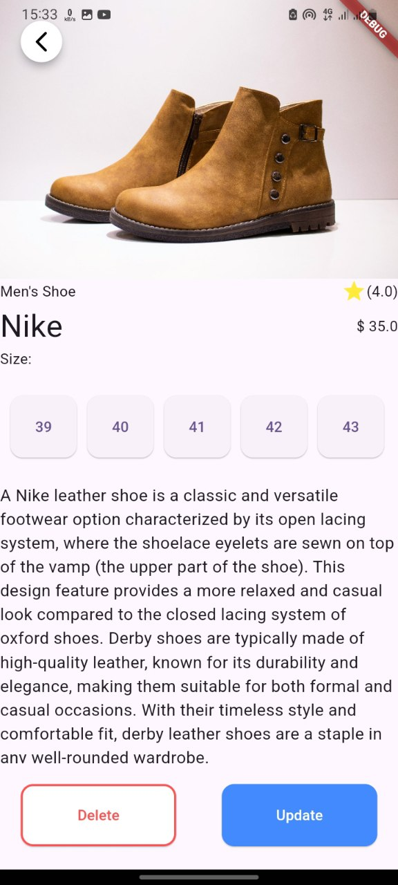
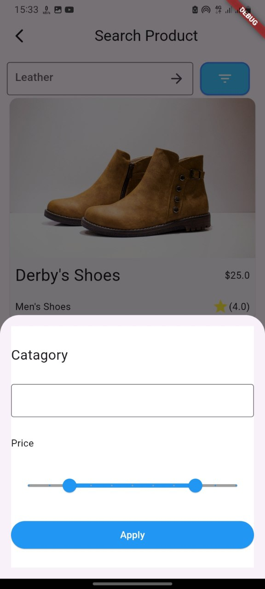
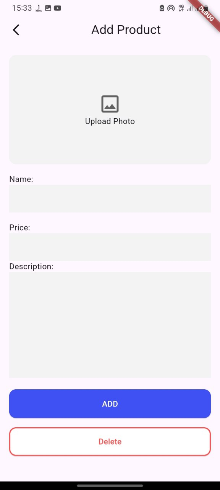

# Project Overview
This project is structured following the Clean Architecture principles, ensuring a clear separation of concerns and a scalable, maintainable codebase. The architecture is divided into distinct layers: Domain, Data, and Presentation (to be completed). Each layer has its own responsibility and interacts with the others through well-defined interfaces.

# Layers Overview
## 1. Domain Layer
The Domain Layer is the core of the application, containing business logic and essential rules. It is independent of any external layers, making it the most stable part of the architecture.

### Use Cases:
#### DeleteProductUsecase: Handles the business logic for deleteing a product from the system.
#### GetProductUsecase: Handles the business logic for fetching a product from the system.
#### UpdageProductUsecase: Handles the business logic for updating a product details from the system.
#### InsertProductUsecase: Handles the business logic for inserting a product into the system.
### Abstract Class:
#### ProductRepository: Defines the contract for any data source (local or remote) that will handle product data. This abstract class includes methods like createProduct, updateProduct, deleteProduct, and getProduct.
### Failure Class:
This class is used to encapsulate any failures that occur within the domain layer, providing a unified way to handle errors.
## 2. Data Layer
The Data Layer is responsible for managing data sources, whether they are from a local database, remote API, or other sources. This layer implements the ProductRepository interface defined in the domain layer.

### ProductModel:
This is the data model that represents the product entity within the data layer. It is responsible for converting raw data into domain entities and vice versa.
## 3. Presentation Layer 
The Presentation Layer will handle the UI and user interaction aspects of the application. This layer will interact with the domain layer through use cases, ensuring that the presentation logic remains separate from business rules.

## Testing
Testing is an integral part of the project. Tests have been written for the components built so far, including:

### Domain Layer:
Tests for the use cases, ensuring that they behave as expected under different scenarios.
### Data Layer:
Tests for the ProductModel, verifying that it correctly handles data transformation and adheres to the contract defined in the domain layer.
### Mocks and Stubs:
Mockito has been used to create mocks and stubs, enabling the testing of interactions between different layers without relying on actual data sources.
Future Development
## Conclusion
This project is a work in progress, adhering to Clean Architecture principles to ensure a well-organized and maintainable codebase. As the project grows, additional layers and components will be implemented and tested, continuing to follow the architecture’s best practices.

# Home Page

# Description Page

# Search Page

# Add/Update Page

